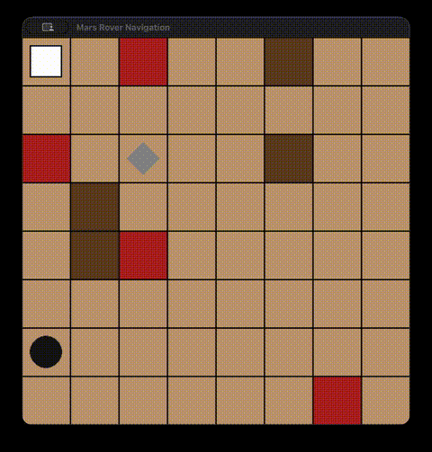

# Autonomous Mars Rover Navigation

An RL agent using a recurrent (LSTM) policy with Proximal Policy Optimization. 
Trained to navigate a rover through randomized Mars-like terrain, picking up a rock sample and delivering it to a lander under partial observability.


## Demo

<!-- Paste your GitHub-hosted video URL here, or reference demo.gif if using that route -->


## The Problem

The rover has to:

1. Navigate to a randomly placed rock sample and collect it.
2. Navigate to a randomly placed lander and deliver it.

While avoiding craters (costly but survivable) and cliffs (instant episode-ending failure), using only a local view of the terrain.

## Results

Evaluated over 100 episodes on freshly generated 8x8 randomized layouts (obstacle placement, spawn, and target all randomized per episode):

| | Success Rate | Path Efficiency (vs. A*) | Cliff Rate |
|---|---|---|---|
| Random policy | 4% | — | — |
| A* search (full map access) | 100%* | 100% (optimal, 14.5 avg steps) | 0% |
| **PPO + LSTM** | **99%** | **91%** (15.99 avg steps) | **1%** |

A* is a planning algorithm with complete knowledge of the map, obstacles, and target locations. It's the theoretical efficiency ceiling, not a competing learned agent. PPO only observes a local 5x5 window around the rover, a rough distance signal to the current target, and whether it's currently carrying the sample.


## Architecture

- **Environment:** custom grid world with procedurally generated crater/cliff terrain, randomized rover spawn, sample location, and lander location every episode
- **Observation:** local 5x5 terrain window (one-hot encoded), a binned distance signal to the current target, and a carrying-sample flag — no global map access
- **Policy network:** LSTM-based recurrent policy
- **Algorithm:** PPO clipped surrogate objective, Generalized Advantage Estimation, truncated BPTT
- **Baselines:** A* search (optimal path) and random policy, both implemented for direct comparison


## Tech Stack

Python, PyTorch, Gymnasium, PyGame

## Setup

```bash
# install dependencies
pip install -r requirements.txt

# run the pretrained policy with visualization
python src/render.py

# run baseline comparisons
python src/baselines.py
```